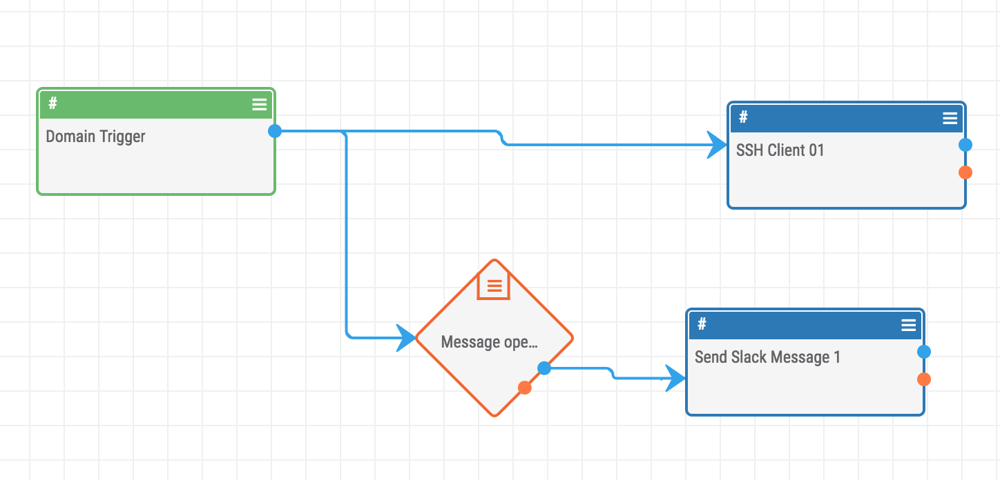

# Week 2 - Incident response playbooks
This week we are going to review last week's demo and have a discussion on lessons learned from the incident. Next, we had a discussion on how to make a playbook for a coompromised account. For this week's demo we will be using Threatconnect a threat intel platform to create automated playbooks. These automated playbooks will take in some type of information such as domain or IP address and provide results. 

## Presentation 
Crafting infosec playbook: https://docs.google.com/presentation/d/1ViV1Qohcuc12U5i0hKw8hEfnTTGd-OgWXqjquW1St_8/edit?usp=sharing

## Playbook - Compromised account 
Google Doc: https://docs.google.com/document/d/1WOsmvGBKw1PtGfz4SGsoGLALkIO-wHDB1S279rO5lgw/edit?usp=sharing 

## Creds document
Google Doc: https://docs.google.com/document/d/1oIKoD0hE7dDbBbXOG8kN_xTeMZMiDHwLYbH2Nm-oD2o/edit?usp=sharing

## Demo
### Setup demo with Ansible
0. vim hosts and add ip addr to "[dns_demo]"
0. ansible-playbook -i hosts deploy_demo.yml -u ubuntu

### Picking a malware
Since we don't have an active adversary we are going to use threat intelligence to create a "profile" for our attacker. To do this we will analyze APT(Advance persistent threat) groups. This activity will help you gain some understanding of the attackers motives and some indicators to create a playbook.

0. Browse to: https://attack.mitre.org/wiki/Groups
0. Select one of the APT_X groups that seems the most interesting to you.
    1. APT33 is very recent and it has a bunch of indicators
0. Provide the following pieces of information, if avaliable:
    1. What are some aliases known to this type of this attack?
    1. What group/government was attributed to this attacker?
    1. What are three red team operation techniques used by the attackers?
    1. Using resources avaliable, what domain names/IP addresses were assoicated with these attackers?
    1. What are some hashes associated with the attack?

### Create Threatconnect playbook
0. Browese to "https://app.threatconnect.com/login.xhtml" and login with creds above
    1. The Google Doc above with credentials is ONLY visible to users of the RIT Google Organization
0. Select "Browse" > "Groups" > "Adversary"     
0. Enter "APT_X" into the search
0. Select the most relevant option for your APT group.
0. 

### Automated Playbook
#### Create playbook
0. Select "Playbooks" at the top then "New playbook"
    1. Enter a name such as APTX_01
    1. Select create

#### Create indicator
0. On the left side under "Indicator" select "Host"
0. Double-click the new trigger object on the grid
0. Configure
    1. Enter "Domain trigger" for name
    1. Select Next
0. Action
    1. Select "rc3@rit.edu" for owner
    1. Select "Create" for action type
    1. Select next
0. Filters
    1. Select "Confidence" for Add filters
    1. Select ">=" for key and enter "25" for value
    1. Save

#### Create app
0. Select "+ App" in the top left
0. Select "SSH client" under "client"
0. Double-click the new app object on the grid
0. Edit app: SSH client
    1. Enter "SSH client X" for name
    1. Enter "13.57.190.48" for hostname
    1. Enter "2222" for port
    1. Enter "[username from cred sheet above]" for username
    1. Enter "[password from cred sheet above]" for password
    1. Leave SSH Private key blank
    1. Enter "./dns_blacklist.sh #trg.tc.host"
        2. When you enter # a dropdown menu will appear and these are variables
    1. Check "Use sudo"
    1. Select "Save"
0. Drawl a line from the Domain trigger object to the SSH client object  

#### Create operator
0. Select "+ Operator" at the top left
0. Select "If/Else" under "Operators"
0. Drawl a line from the indicator object to operator object
0. Double-click the new operator object on the grid
0. Edit operatorL if/else
    1. Enter "Message operator"
    1. Enter "#trg.tc.confidence" into first operand
    1. Select "greater than" for operator
    1. Enter "25" into second operator
    1. Select "Treat as number"
    1. Select Save

#### Create Slack notification
0. Select "+ App" in the top left
0. Select "Send Slack message" under "client"
0. Drawl a line from the operator object to the new app object for Slack
0. Double-click the new app object on the grid
0. Edit app: Send Slack message
    1. Enter "Slack messenger" for name
    1. Enter "ig-guardians-demo" for Slack API recipient 
    1. Enter "[Slack token from creds sheet]" into Slack API token
    1. Enter "Domain: #trg.tc.host has been added to DNS blacklist"
    1. Select save

#### Running the playbook
0. 

## Scripting challenges
0. Create an account on Virustotal
0. Obtain your API key
0. Create a script to use the Virustotal API to pull down data about a domain
0. Repeat the step above but with ThreatMiner.org
0. Have your script take in a file that has a list of domains

# Resources/Sources
* https://www.amazon.com/Crafting-InfoSec-Playbook-Security-Monitoring/dp/1491949406/ref=sr_1_1?ie=UTF8&qid=1519108826&sr=8-1&keywords=crafting+the+infosec+playbook&dpID=51z900Bs5XL&preST=_SX218_BO1,204,203,200_QL40_&dpSrc=srch
* https://www.demisto.com/wannacry-ransomware-incident-response-playbook/
